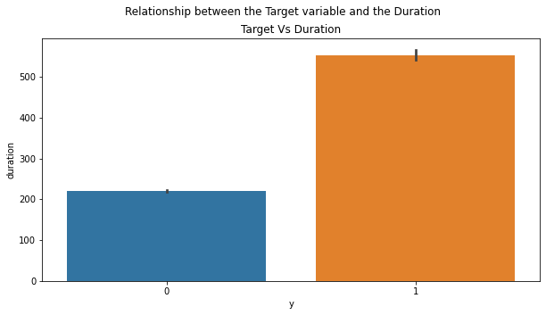

# Classification Analysis

## Abstract

The data is related with direct marketing campaigns (phone calls) of a Portuguese banking institution. The classification goal is to predict if the client will subscribe a term deposit (variable y).

## Data

Link to data: https://archive.ics.uci.edu/ml/datasets/Bank+Marketing

- age 

- job: type of job ('admin.','blue-collar','entrepreneur','housemaid','management','retired','self-employed','services','student','technician','unemployed','unknown')

- marital: marital status ('divorced','married','single','unknown'; note: 'divorced' means divorced or widowed)

- education: ('basic.4y','basic.6y','basic.9y','high.school','illiterate','professional.course','university.degree','unknown')

- default: has credit in default? 

- housing: has housing loan? 

- loan: has personal loan? 

- contact: contact communication type ('cellular','telephone')

- month: last contact month of year ('jan', 'feb', 'mar', ..., 'nov', 'dec')

- day_of_week: last contact day of the week ('mon','tue','wed','thu','fri')

- duration: last contact duration, in seconds.

- campaign: number of contacts performed during this campaign and for this client.

- pdays: number of days that passed by after the client was last contacted from a previous campaign.

- previous: number of contacts performed before this campaign and for this client.

- poutcome: outcome of the previous marketing campaign ('failure','nonexistent','success')

- emp.var.rate: employment variation rate 

- monthly indicator 

- cons.conf.idx: consumer confidence index 

- euribor3m: euribor 3 month rate 

- nr.employed: number of employees 

- y - has the client subscribed a term deposit? 

## Overview

This project is designed to explore machine learning models and methods for the task of classification. We've been tasked with finding a dataset with labeled data with at least 40,000 rows of data and 20 columns. We will follow the OSEMN process for a data science project, which includes:

- Obtaining the data
- Scrubing (or cleaning) the data
- Exploring and visualizing the data
- Modeling
- INterpreting the results
- Project goal: The data we will be using (more below) is a bank marketing campaign data set. The goal for our project is to develop a model that predicts the success of a bank marketing campaign based on the features we have in our data. This model help us to identify potential customers and refine our focus of future campaigns.

## Modeling

We are going to try different models. In this section we will work through,

- Logistic Regression
- Decision Tree
- Random Forest
- XGBoost
- We'll also apply grid search method for each model and see how it performs for different hyperparameter tuning. 

## Interpret

In XG Boost Model, 
- True Positive : 694(Number of customers deposited )
- True Negative : 6744(Number of customers didn't deposit)
- False Positive : 559(Number of customers didn't deposit but predicted as deposited)
- False Negative : 241(Number of customers deposited but predicted as not deposited)
In this scenario, it is important to reduce the False positive number. 

- From our overall analysis duration plays the important role . More the people who are engaged in call are likely to make deposit.

- People working as technicians, admin and blue collar jobs are targeted for the campaign and they are more likely to place deposit.

## Next Step

Futhure work would be on reducing the false negative cases and to build a more stable model to improve the performance.
Total actual deposit made by the customers were just 11% from the overall customers. Hence more analyis is needed to check how many people deposit without conducting campaign to check if the campaign is beneficial to the bank.

